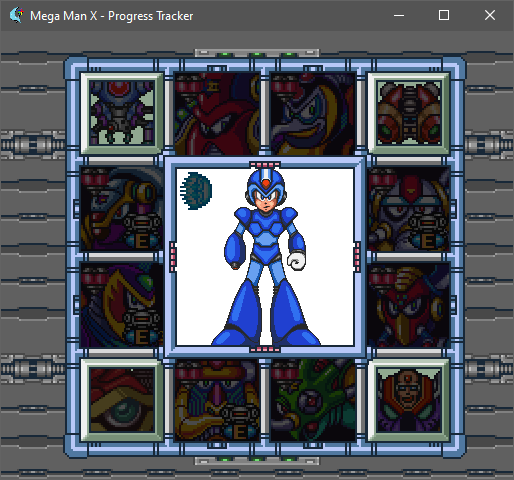

# MegaManX Progression Tracker for the SD2SNES

## How to use

1. First you need to install the USB firmware for the SD2SNES available [here](https://usb2snes.com/)
1. Next you need a usb2snes server, either the one bundled with the USB2SNES firmware or [QUsb2Snes](https://skarsnik.github.io/QUsb2snes/)
1. Install [Magic2snes](https://github.com/Skarsnik/Magic2snes/tags)
1. Download a release of this script
1. Run it using Magic2snes

## Acknowledgments

* [RetroAchievements](https://retroachievements.org/) for the RAM map documentation that save me tons of time
* [The Spriters Ressource](https://www.spriters-resource.com/) for the spritesheets

## License

Licensed under the MIT License

Copyright (c) 2020 Wendigo Jaeger <wendigojaegersama@gmail.com>